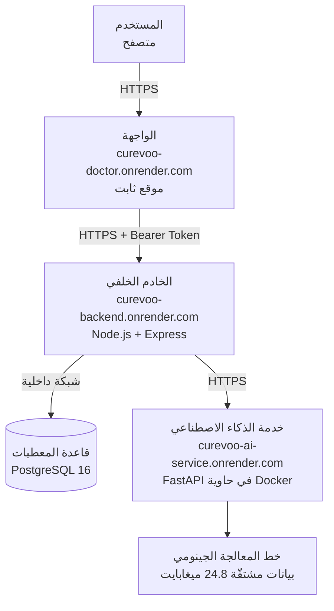

# نشر النظام (Deployment)

## مقدمة

لا يكتمل أي نظام برمجي بمجرد عمله على جهاز المطوّر. فالفارق بين نموذج أوّلي يعمل محلياً ونظام حقيقي يمكن لغيرك أن يجرّبه هو فارق جوهري، يكشف عن مسائل لا تظهر إطلاقاً في بيئة التطوير: كيف تتحدث الخدمات فيما بينها عبر الشبكة، وكيف تُحفظ الأسرار بعيداً عن الشيفرة، وكيف يتصرف النظام حين تتعطل إحدى مكوّناته، وكيف يُحمَّل على متصفح المستخدم بأقل كلفة ممكنة.

وقد نُشر هذا المشروع فعلياً على الإنترنت بحيث يمكن الوصول إليه من أي جهاز عبر رابط عام، وهذا الفصل يوثّق كيف تم ذلك، وما القرارات التصميمية التي اتُّخذت في أثنائه، وما حدود البيئة المستخدمة.

## معمارية النشر

يتكوّن النظام من ثلاث خدمات مستقلة وقاعدة معطيات، وقد نُشرت جميعها على منصة **Render** في مركز بيانات **فرانكفورت**، وهو الأقرب جغرافياً إلى المستخدمين المستهدفين في المنطقة.



والمبدأ الحاكم لهذه المعمارية أن **كل طبقة تعرف الطبقة التي تليها فقط**. فالمتصفح لا يعرف عنوان خدمة الذكاء الاصطناعي ولا يستطيع مخاطبتها مباشرة، بل يمر كل طلب عبر الخادم الخلفي الذي يتولّى وحده التوثّق من هوية المستخدم والتحقق من صحة المدخلات وإخفاء أي تفصيل داخلي قد يتسرّب من الخدمة العميقة. وهذا الفصل ليس تعقيداً زائداً، بل هو ما يجعل من الممكن تغيير خدمة الذكاء الاصطناعي أو نقلها أو استبدالها دون أن يشعر المتصفح بشيء.

## نشر الطبقات الثلاث

### أولاً: خدمة الذكاء الاصطناعي

نُشرت هذه الخدمة داخل **حاوية Docker** مبنية على صورة `python:3.11-slim`. وقد كان اختيار الحاوية هنا مقصوداً: فالخدمة تعتمد على مكتبات حسابية لها إصدارات حسّاسة، والحاوية تضمن أن ما يعمل في بيئة التطوير هو نفسه ما يعمل على الخادم بلا اختلاف.

وأهم قرار اتُّخذ في هذه المرحلة هو **التمييز بين بيانات التدريب وبيانات التشغيل**. فمجلد البيانات في المشروع يبلغ حجمه نحو **540 ميغابايت**، لكن فحص مسار الطلب أظهر أن الخدمة لا تفتح عند التشغيل سوى خمسة ملفات مشتقّة لا يتجاوز مجموعها **24.8 ميغابايت**:

| الملف | الحجم | الغرض |
| --- | ---: | --- |
| target_ranking_v6_evidence_tiers.csv | 10.85 MB | ترتيب المجموعة المرجعية |
| gtex_lung_safety_features.csv | 13.06 MB | سياق السلامة من الأنسجة الطبيعية |
| external_targets_consensus_ncg_civic.csv | 0.88 MB | الأدلة الخارجية |
| ملفا مقاييس التقييم | 0.003 MB | نتائج التقييم المحفوظة |

أما مصفوفات التعبير الجيني الخام التي يبلغ حجم الواحدة منها 178 ميغابايت، فهي مُدخلات لخط المعالجة غير المتصل (offline pipeline) الذي يُنتج تلك الملفات المشتقّة، ولا تُقرأ إطلاقاً أثناء تلبية طلب المستخدم. ولذلك استُبعدت من الحاوية ومن المستودع معاً.

وعلى المنوال نفسه، أظهر فحص المكتبات المُستوردة فعلياً في مسار الطلب أن الخدمة لا تحتاج إلى `scikit-learn` ولا `scipy` ولا `xgboost`، إذ تُستخدم هذه المكتبات حصراً في نصوص التدريب والتقييم التي لا تعمل داخل الحاوية. فأُفرد لها ملف اعتماديات مستقل يقتصر على ست مكتبات:

```
fastapi · uvicorn · pydantic · pandas · numpy · python-multipart
```

وكانت النتيجة أن الخدمة تعمل باستهلاك ذاكرة قدره **نحو 160 ميغابايت** فقط، وهو ما يجعلها تتّسع بأريحية داخل حدود الخطة المجانية البالغة 512 ميغابايت.

### ثانياً: الخادم الخلفي

نُشر الخادم الخلفي على بيئة **Node.js** الأصلية دون حاوية، لبساطة اعتمادياته واستقرارها. ويجري في مرحلة البناء توليد عميل Prisma، وفي مرحلة الإقلاع تُزامَن بنية قاعدة المعطيات قبل تشغيل الخادم:

```
البناء  : npm install && npx prisma generate
الإقلاع : npx prisma db push && npm start
```

ويتصل الخادم بقاعدة المعطيات عبر **عنوان الشبكة الداخلية** لا العنوان الخارجي. وقد كان هذا تصحيحاً ضرورياً بعد أن أخفق النشر مرتين بالخطأ `P1017: Server has closed the connection` نتيجة استخدام العنوان الخارجي، وهو عنوان مخصّص للوصول من خارج المنصة لا من خدمة تعمل داخلها. والاتصال الداخلي أسرع وأكثر أماناً لأنه لا يغادر شبكة مركز البيانات أصلاً.

### ثالثاً: الواجهة

نُشرت الواجهة بوصفها **موقعاً ثابتاً**، وهو الخيار الأنسب لتطبيق Flutter مُصرَّف إلى JavaScript، إذ لا يحتاج إلى عملية قيد التشغيل على الخادم، فيُخدَّم من شبكة توزيع المحتوى مباشرةً ولا يتأثر بدخول الخدمات في وضع السكون.

وقد استلزم ذلك معالجة قيدين تقنيين:

**الأول** أن بيئة البناء على المنصة لا تتضمّن حزمة تطوير Flutter، فبُنيت الحزمة محلياً ورُفعت جاهزة إلى المستودع في مجلد `web-dist`.

**الثاني**، وهو الأدق، أن عنوان الخادم الخلفي في تطبيق Flutter يُحقن **وقت التصريف** لا وقت التشغيل، عبر الوسيط `--dart-define`. أي أن العنوان يُدفن داخل حزمة JavaScript الناتجة، ولا يمكن تغييره لاحقاً دون إعادة بناء. ولهذا رُتّبت خطوات النشر بحيث يُنشأ الخادم الخلفي أولاً ويُعرف عنوانه النهائي، ثم تُبنى الواجهة على ذلك العنوان.

## الإعدادات والأمان

فُصلت جميع الأسرار عن الشيفرة وحُفظت في متغيّرات بيئة على المنصة:

| المتغيّر | الغرض |
| --- | --- |
| `DATABASE_URL` | عنوان الاتصال الداخلي بقاعدة المعطيات |
| `JWT_ACCESS_SECRET` / `JWT_REFRESH_SECRET` | توقيع رموز الوصول والتجديد |
| `AI_SERVICE_URL` | عنوان خدمة الذكاء الاصطناعي، يعرفه الخادم الخلفي وحده |
| `CORS_ALLOWED_ORIGINS` | قائمة النطاقات المسموح لها بمخاطبة الواجهة البرمجية |
| `REFRESH_COOKIE_SAMESITE` | ضبط سلوك ملف الارتباط بين نطاقين مختلفين |
| `AI_GENOMIC_HEALTH_TIMEOUT_MS` | مهلة فحص جاهزية خدمة الذكاء الاصطناعي |

وقد وُلِّدت مفاتيح التوقيع من جديد عشوائياً عند النشر ولم تُستخدم القيم النموذجية الواردة في ملف المثال. كما جرى قبل رفع الشيفرة **فحص المستودع بالكامل** للتأكد من خلوّه من أي مفتاح أو كلمة سر حقيقية، فتبيّن أن كل ما ورد فيه قيم نموذجية صريحة، وأن ملف `.env` غير مرفوع في أي إصدار من تاريخ المستودع.

ومن المسائل الدقيقة التي ظهرت عند النشر مسألة **ملف الارتباط عبر النطاقات**. فالواجهة والخادم الخلفي يقعان على نطاقين مختلفين، وملف ارتباط التجديد كان مضبوطاً افتراضياً على `SameSite=Strict`، ما يعني أن المتصفح يمتنع عن إرساله في هذه الحالة فتنقطع الجلسة صامتةً. وعولج ذلك بضبطه على `SameSite=None` مع تفعيل وضع الإنتاج الذي يفرض الخاصية `Secure`، إذ ترفض المتصفحات الحديثة الجمع بين الأولى دون الثانية.

## تهيئة المستودع للنشر

كان المشروع في صورته الأولى يبلغ **1.85 غيغابايت**، ويتضمّن ملفات يتجاوز حجم الواحد منها 100 ميغابايت، وهو الحد الأقصى الذي تقبله منصة GitHub للملف الواحد. أي أن رفعه كان سيُرفض من الأساس.

فأُعدّ ملف `.gitignore` يستثني مُدخلات خط المعالجة الخام ومخرجات البناء والاعتماديات، مع الإبقاء على الملفات المشتقّة التي تحتاجها الخدمة فعلاً وقت التشغيل. وقد أثمر ذلك مستودعاً عملياً قابلاً للاستنساخ والنشر في زمن معقول.

## قياسات الأداء بعد النشر

| القياس | محلياً | على الاستضافة |
| --- | ---: | ---: |
| فحص الجاهزية | 22.6 ms | 849.4 ms |
| التحليل على المجموعة المرجعية | 182.8 ms | 2141.2 ms |
| التحليل على ملفات مرفوعة | 486.9 ms | 6408.9 ms |
| تسجيل الدخول | 312.9 ms | 2229.2 ms |

والفارق بين البيئتين ليس فارقاً في كفاءة الشيفرة بل في زمن انتقال الشبكة، ويتضح ذلك من أن المسارات الخفيفة تُظهر فارقاً أكبر بكثير من المسارات الحسابية الثقيلة، لأن زمن المعالجة في الأخيرة يبدأ بالهيمنة على زمن الشبكة.

وتُطبّق المنصة ضغط **Brotli** تلقائياً على الملفات النصية، فينخفض حجم حزمة التطبيق الرئيسية من 4347.7 كيلوبايت إلى **1218.6 كيلوبايت**، أي بنسبة ضغط تقارب 3.6 أضعاف.

## حدود البيئة المستخدمة

تُذكر هذه الحدود صراحةً لأن إغفالها يعطي انطباعاً غير دقيق عن جاهزية النظام للتشغيل الفعلي:

**أولاً، سكون الخدمات.** تُدخل الخطة المجانية أي خدمة في وضع السكون بعد نحو خمس عشرة دقيقة من الخمول، فيستغرق أول طلب بعدها **22.6 ثانية** لخدمة الذكاء الاصطناعي و**32.9 ثانية** للخادم الخلفي حتى تصحو. ولهذا رُفعت مهلة فحص الجاهزية من ثماني ثوانٍ إلى ستين، لأن القيمة الافتراضية كانت تُنهي الطلب قبل أن تكتمل عملية الصحو فيظهر النظام معطلاً وهو سليم. أما الواجهة فلا تتأثر بذلك لكونها ملفات ثابتة.

**ثانياً، مدة بقاء قاعدة المعطيات.** تُحذف قاعدة المعطيات المجانية بعد نحو ثلاثين يوماً من إنشائها، وهو ما يستدعي الانتقال إلى خطة مدفوعة أو إلى مزوّد آخر عند الحاجة إلى تشغيل مستمر.

**ثالثاً، زوال نظام الملفات.** يُعاد إنشاء نظام ملفات الخدمة عند كل إعادة تشغيل، فتُفقد تقارير التحليلات السابقة المحفوظة على القرص. ولا يؤثر هذا في صحة النتائج لأن استجابة التحليل مكتفية بذاتها وتتضمّن كل ما يحتاجه العميل، لكنه يعني أن استرجاع تقرير قديم قد يفشل بعد إعادة التشغيل.

## خلاصة

النظام منشور فعلياً وقابل للوصول من أي جهاز، وقد تحقّق من عمل المسار الكامل — من الواجهة إلى الخادم الخلفي إلى خدمة الذكاء الاصطناعي وعودة النتائج إلى الشاشة — على البيئة المنشورة نفسها لا على بيئة التطوير.

| المكوّن | العنوان |
| --- | --- |
| الواجهة | `https://curevoo-doctor.onrender.com` |
| الخادم الخلفي | `https://curevoo-backend.onrender.com` |
| خدمة الذكاء الاصطناعي | `https://curevoo-ai-service.onrender.com` |
| الشيفرة المصدرية | `https://github.com/TariqAlahmer23/curevoo-platform` |

وقد كشف النشر عن مسائل لم تكن لتظهر محلياً على الإطلاق: عنوان قاعدة المعطيات الداخلي مقابل الخارجي، وملف الارتباط بين النطاقات، ومهلة فحص الجاهزية أمام الإقلاع البارد، وحقن عنوان الخادم وقت التصريف في تطبيق Flutter. وهذه المسائل مجتمعةً تمثّل الفارق العملي بين نظام يعمل على جهاز واحد ونظام يعمل للناس.
