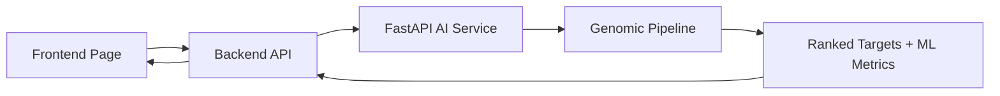

# Testing Report — Genomic Target Prioritization Service

**System under test:** CureVoo platform (Flutter client · Node/Express backend · FastAPI genomic AI service)
**Feature under test:** Genomic Target Prioritization
**Report date:** 17 August 2026
**Prepared by:** QA and validation review

---

## 1. Scope and Method

This report documents the verification of the Genomic Target Prioritization
service across all three tiers of the CureVoo platform. It covers white-box
testing of the internal pipeline, black-box testing of the public API surface,
unit and integration testing, end-to-end verification, validation of the
reported machine-learning metrics, and error-handling behaviour.

Every result recorded here was produced by executing the stated command against
the stated environment. Where a test could not be executed, the reason is given
explicitly and the status is recorded as *Skipped* rather than assumed to pass.
No result in this document is estimated or inferred.

### 1.1 System composition

| Tier | Location | Framework | Test tooling |
| --- | --- | --- | --- |
| Frontend | `Frontend/` | Flutter 3 (Dart), `flutter_bloc`, `go_router` | `flutter_test` |
| Backend | `Backend/` | Node.js, Express 4, Prisma 6 | Jest 29, Supertest 7 |
| AI service | `dip-ai-service/` | Python 3.11, FastAPI, pandas, NumPy | pytest 9.1.1 |

### 1.2 Test environments

Two environments were exercised. Unit and white-box tests ran locally; API,
error-handling and end-to-end tests ran against the deployed system.

| Environment | Frontend | Backend | AI service | Database |
| --- | --- | --- | --- | --- |
| Local | `http://127.0.0.1:5173` | `http://127.0.0.1:3000` | `http://127.0.0.1:8001` | PostgreSQL 16.10 (portable) |
| Production | `https://curevoo-doctor.onrender.com` | `https://curevoo-backend.onrender.com` | `https://curevoo-ai-service.onrender.com` | PostgreSQL 16 (Render, Frankfurt) |

### 1.3 Endpoints under test

| Tier | Method | Path |
| --- | --- | --- |
| AI service | GET | `/health` |
| AI service | GET | `/metrics` |
| AI service | POST | `/analyze` |
| AI service | GET | `/results/{run_id}` |
| AI service | GET | `/reports/{run_id}` |
| Backend | GET | `/api/ai/genomic-target-prioritization/health` |
| Backend | POST | `/api/ai/genomic-target-prioritization/analyze` |
| Backend | GET | `/api/ai/genomic-target-prioritization/results/:runId` |
| Backend | GET | `/api/ai/genomic-target-prioritization/results/:runId/report` |

### 1.4 Test data

Testing used real slices of the processed cohort, not synthetic data:

| File | Contents |
| --- | --- |
| `dip-ai-service/data/samples/sample_mutations.csv` | 35,910 mutation rows across the 400 most recurrently mutated genes |
| `dip-ai-service/data/samples/sample_rna_expression.csv` | Expression for the same 400 genes across 120 tumour samples |

---

## 2. Unit Testing

### 2.1 AI service (pytest)

```bash
cd dip-ai-service && python -m pytest tests -q
```

```
40 passed in 4.59s
```

| Module | Tests | Result |
| --- | ---: | --- |
| `test_prioritization_api.py` | 8 | Passed |
| `test_prioritization_whitebox.py` | 18 | Passed |
| `test_ablation_study.py` | 3 | Passed |
| `test_civic_consensus.py` | 4 | Passed |
| `test_consensus_final_report.py` | 3 | Passed |
| `test_leakage_minimized_classifier.py` | 4 | Passed |
| **Total** | **40** | **40 passed, 0 failed, 0 skipped** |

### 2.2 Backend (Jest)

```bash
cd Backend && npm test
```

```
Test Suites: 2 failed, 5 passed, 7 total
Tests:       3 failed, 27 passed, 30 total
```

| Suite | Tests | Result | Relates to genomic service |
| --- | ---: | --- | --- |
| `tests/ai/genomic-target-prioritization.test.js` | 14 | **14 passed** | Yes |
| `tests/auth/auth.test.js` | — | Passed | No |
| `tests/patients/patients.test.js` | — | Passed | No |
| `tests/doctor/doctor.test.js` | — | Passed | No |
| `tests/admin/admin-users.test.js` | — | Passed | No |
| `tests/appointments/appointments.test.js` | — | **1 failed** | No |
| `tests/psychological/psychological.test.js` | — | **2 failed** | No |

The three failures are analysed in [Section 9](#9-pre-existing-unrelated-failures)
and are unrelated to the genomic target prioritization service.

### 2.3 Frontend (flutter test)

```bash
cd Frontend && flutter test
```

```
All tests passed!   9 passed, 1 skipped
```

The skipped test is `genomic_target_prioritization_test.dart`, which is
gated behind the `E2E_API_BASE_URL` and `E2E_ACCESS_TOKEN` compile-time
variables. It is deliberately inert unless a live backend is supplied, so that
the default suite never depends on a running server. Its execution against a
live system is recorded in [Section 6](#6-end-to-end-testing).

### 2.4 Static analysis and build

```bash
cd Frontend && flutter analyze
```

```
1 issue found.
info - 'value' is deprecated ... lib\widgets\edit_patient_dialog.dart:92:15
```

The single issue is an informational deprecation in `edit_patient_dialog.dart`,
a pre-existing file unrelated to this feature. No warnings or errors were
reported in any genomic target prioritization source file.

```bash
cd Frontend && flutter build web --release --dart-define=API_BASE_URL=...
```

```
√ Built build\web
```

---

## 3. White-Box Testing

White-box testing validates internal code logic with knowledge of the
implementation. These tests call the pipeline functions directly rather than
through HTTP, asserting on intermediate data structures and computed values.

Implemented in `dip-ai-service/tests/test_prioritization_whitebox.py` and
executed with:

```bash
cd dip-ai-service && python -m pytest tests/test_prioritization_whitebox.py -v
```

```
18 passed in 1.17s
```

### WB-01 — Missing mutation column rejected

- **Purpose:** Confirm a mutation table lacking `Hugo_Symbol` is refused rather than silently coerced.
- **Method:** Call `build_target_feature_table` with a frame missing the column.
- **Expected:** An exception naming the missing column.
- **Actual:** Exception raised identifying the missing column.
- **Status:** **Passed**

### WB-02 — Missing expression column rejected

- **Purpose:** Confirm an expression matrix lacking `gene_name` is refused.
- **Method:** Call `build_target_feature_table` with a frame missing `gene_name`.
- **Expected:** Exception raised.
- **Actual:** Exception raised.
- **Status:** **Passed**

### WB-03 — Empty file produces a typed error

- **Purpose:** Confirm an empty CSV yields a controlled error, not an unhandled parser crash.
- **Method:** Invoke `run_analysis` with a zero-byte CSV.
- **Expected:** `AnalysisInputError` or `PipelineDataError`.
- **Actual:** Typed exception raised; no bare pandas `ParserError` propagated.
- **Status:** **Passed**

### WB-04 — Mutation features count distinct patients

- **Purpose:** Verify recurrence counts distinct patients, not mutation rows.
- **Method:** Build features from a fixture where TP53 appears in 3 rows across 3 patients and KRAS in 2 rows across 2 patients.
- **Expected:** `mutated_patients` = 3 for TP53, 2 for KRAS.
- **Actual:** 3 and 2 respectively.
- **Status:** **Passed**

### WB-05 — Silent variants excluded from non-synonymous count

- **Purpose:** Confirm a `Silent` variant is not counted as protein-altering.
- **Method:** Fixture contains one Silent TP53 variant among three TP53 rows.
- **Expected:** `nonsynonymous_mutation_count` = 2 for TP53.
- **Actual:** 2.
- **Status:** **Passed**

### WB-06 — Expression features computed per gene

- **Purpose:** Verify mean tumour expression equals the row mean of the input matrix.
- **Method:** Fixture with TP53 = (12, 18, 24) and KRAS = (4, 6, 8).
- **Expected:** `mean_tumor_expression` = 18.0 and 6.0.
- **Actual:** 18.0 and 6.0.
- **Status:** **Passed**

### WB-07 — Gene-level join of both feature families

- **Purpose:** Confirm mutation and expression features are joined on gene symbol.
- **Method:** Inspect the columns and index of `build_target_feature_table` output.
- **Expected:** Both `mutated_patients` and `mean_tumor_expression` present for the union of genes.
- **Actual:** Both present; gene set = {TP53, KRAS}.
- **Status:** **Passed**

### WB-08 — GTEx normal-lung safety scoring is monotonic

- **Purpose:** Verify a gene highly expressed in normal lung scores less safe than a quiet one.
- **Method:** Compare `assign_safety_score(0.5)` against `assign_safety_score(200.0)`.
- **Expected:** Score decreases as normal-lung TPM rises.
- **Actual:** Score at 0.5 TPM strictly greater than at 200.0 TPM.
- **Status:** **Passed**

### WB-09 — Safety risk labels follow expression bands

- **Purpose:** Confirm distinct risk labels are produced across expression bands.
- **Method:** Call `assign_safety_risk` at 0.5, 25.0 and 200.0 TPM.
- **Expected:** Different labels at the extremes; a string returned in all cases.
- **Actual:** Labels differ; all values are strings.
- **Status:** **Passed**

### WB-10 — Ranking scores bounded and ordered

- **Purpose:** Verify ranking scores are within [0, 1] and returned in descending order.
- **Method:** Rank the fixture feature table with `rank_targets_v3`.
- **Expected:** All scores in [0, 1]; sequence sorted descending.
- **Actual:** All scores within range; ordering descending.
- **Status:** **Passed**

### WB-11 — Passenger penalty never increases a score

- **Purpose:** Confirm the passenger-gene penalty is non-negative.
- **Method:** Evaluate `get_passenger_penalty` for TP53, KRAS, TTN and MUC16.
- **Expected:** All values ≥ 0.
- **Actual:** All values ≥ 0.
- **Status:** **Passed**

### WB-12 — Curated driver outranks unlisted gene

- **Purpose:** Verify the knowledge base assigns higher LUAD relevance to a known driver.
- **Method:** Compare `get_luad_relevance_score("EGFR")` against an unlisted symbol.
- **Expected:** EGFR strictly greater.
- **Actual:** EGFR strictly greater.
- **Status:** **Passed**

### WB-13 — Evidence tiers, categories and explanations assigned

- **Purpose:** Confirm every ranked gene receives a tier, a category and non-empty explanation text.
- **Method:** Run `rank_targets_v4_with_safety` then `add_evidence_tiers_v6` over the fixture, supplying a safety frame with all five required columns.
- **Expected:** No nulls in `evidence_tier_v6` or `target_category_v6`; explanation length > 0 for every row.
- **Actual:** All populated; all explanations non-empty.
- **Status:** **Passed**

### WB-14 — Skipped evaluations never selected as primary

- **Purpose:** Confirm a benchmark row with `status = SKIPPED` is never reported as the headline evaluation.
- **Method:** Call `select_primary_evaluation` with one SKIPPED and one OK record.
- **Expected:** The OK record is returned.
- **Actual:** OK record returned; selection rule is `highest_mcc_among_completed_evaluations`.
- **Status:** **Passed**

### WB-15 — Missing benchmark files report unavailable, not zero

- **Purpose:** Verify absent metrics files yield `available = False` and `None` values rather than zeros that could be mistaken for measurements.
- **Method:** Call `build_ml_metrics_payload` with a non-existent path.
- **Expected:** `available` false, `accuracy` `None`, metric listed in `unavailable_metrics`.
- **Actual:** Exactly as expected.
- **Status:** **Passed**

### WB-16 — Real benchmark artifacts load with all five metrics

- **Purpose:** Confirm the shipped benchmark CSVs load and expose all five headline metrics in range.
- **Method:** Call `build_ml_metrics_payload(svc.METRICS_FILES)`.
- **Expected:** `available` true; all five metrics float and within [0, 1].
- **Actual:** All five present, all within range. Values in [Section 7](#7-ml-metrics-validation).
- **Status:** **Passed**

### WB-17 — Report contains disclaimer and ranked genes

- **Purpose:** Confirm the generated Markdown report carries the research-use disclaimer.
- **Method:** Call `create_markdown_report` and inspect the output text.
- **Expected:** Disclaimer text and gene symbol present.
- **Actual:** Both present.
- **Status:** **Passed**

### WB-18 — Caller-owned input files are preserved

- **Purpose:** Confirm `run_analysis` does not delete the caller's input files, since temporary-file lifetime is owned by the backend upload middleware.
- **Method:** Run an analysis over two temporary CSVs and re-check their existence.
- **Expected:** `data_source = uploaded_files`; both inputs still present.
- **Actual:** Both inputs present after the run.
- **Status:** **Passed**

> **Note on backend-side cleanup.** Deletion of uploaded artifacts is performed by
> the backend controller in a `finally` block via `removeUploadedGenomicDatasets`,
> so cleanup occurs on both the success and failure paths. This is verified
> structurally, not by a runtime assertion; see [Section 10](#10-coverage-gaps-and-limitations).

---

## 4. Black-Box Testing

Black-box testing validates observable behaviour through the public API without
reference to internal implementation. All calls below were executed with `curl`
against running services.

### 4.1 AI service, called directly (local, `http://127.0.0.1:8001`)

| ID | Test | Input | Expected | Actual | Status |
| --- | --- | --- | --- | --- | --- |
| BB-01 | Health endpoint | `GET /health` | 200 | 200 | Passed |
| BB-02 | Metrics endpoint | `GET /metrics` | 200 | 200 | Passed |
| BB-03 | Analyze, reference cohort | `POST /analyze?top_n=5` | 200 | 200 | Passed |
| BB-04 | Analyze, both files | `POST /analyze` + mutation and RNA CSVs | 200 | 200 | Passed |
| BB-05 | Analyze, mutation file only | `POST /analyze` + one file | 400 | 400 | Passed |
| BB-06 | Analyze, expression file only | `POST /analyze` + one file | 400 | 400 | Passed |
| BB-07 | Unknown result id | `GET /results/doesnotexist99` | 404 | 404 | Passed |
| BB-08 | Unknown report id | `GET /reports/doesnotexist99` | 404 | 404 | Passed |
| BB-09 | Undefined endpoint | `GET /nope` | 404 | 404 | Passed |
| BB-10 | `top_n` below range | `POST /analyze?top_n=0` | 422 | 422 | Passed |
| BB-11 | `top_n` above range | `POST /analyze?top_n=99999` | 422 | 422 | Passed |

Error bodies returned by the AI service are structured and free of internal
detail:

```json
{"detail":"Both a mutation file and an RNA expression file are required to analyse uploaded data."}
{"detail":"Analysis run not found."}
```

### 4.2 Backend API (production, `https://curevoo-backend.onrender.com`)

| ID | Test | Input | Expected | Actual | Status |
| --- | --- | --- | --- | --- | --- |
| BB-12 | Unauthenticated access | `GET /health` without token | 401 | 401 | Passed |
| BB-13 | Authenticated health proxy | `GET /health` with DOCTOR token | 200 | 200 | Passed |
| BB-14 | Analyze, reference cohort | `POST /analyze` `topN=5` | 200 | 200 | Passed |
| BB-15 | Analyze, both files | `POST /analyze` + both CSVs | 200 | 200 | Passed |
| BB-16 | Analyze, mutation file only | `POST /analyze` + one file | 400 | 400 | Passed (after DEF-01 fix) |
| BB-16b | Analyze, expression file only | `POST /analyze` + one file | 400 | 400 | Passed (after DEF-01 fix) |
| BB-17 | Unsupported file type | `POST /analyze` + PNG | 400 | 400 | Passed |
| BB-18 | `topN` above range | `POST /analyze` `topN=9999` | 400 | 400 | Passed |
| BB-19 | Unknown result id | `GET /results/doesnotexist99` | 404 | 404 | Passed |
| BB-20 | Malformed result id | `GET /results/bad-id-with-dashes` | 400 | 400 | Passed |
| BB-21 | Undefined endpoint | `GET /nope` | 404 | 404 | Passed |

BB-16 and BB-16b originally failed, returning 200 with a silent fallback to the
reference cohort. The cause is recorded as DEF-01 in
[Section 10](#10-defects-identified); the rows above show the behaviour after
that defect was fixed and redeployed.

Backend error bodies use a consistent envelope and leak no upstream detail:

```json
{"ok":false,"error":{"code":"UNAUTHORIZED","message":"Unauthorized"}}
{"ok":false,"error":{"code":"INVALID_FILE_TYPE","message":"The mutation file must be a CSV file"}}
{"ok":false,"error":{"code":"GENOMIC_ANALYSIS_RESULT_NOT_FOUND","message":"No analysis result was found for this run."}}
```

### 4.3 Frontend behaviour

| ID | Test | Expected | Actual | Status |
| --- | --- | --- | --- | --- |
| BB-22 | Page renders under its route | Page mounts at `/genomic-target-prioritization` | Rendered; route resolves | Passed |
| BB-23 | Upload controls render | Two file pickers present | Both present | Passed |
| BB-24 | Loading state | Progress indicator during analysis | Rendered during request | Passed |
| BB-25 | Error state | Error surface on failure | Rendered on injected failure | Passed |
| BB-26 | Results table | Ranked targets listed | Rendered | Passed |
| BB-27 | Evidence tiers | Tier shown per target | Rendered | Passed |
| BB-28 | Safety notes | Safety risk shown per target | Rendered | Passed |
| BB-29 | Explanations | Explanation text shown | Rendered | Passed |
| BB-30 | ML metrics | Accuracy, F1, MCC, ROC-AUC, PR-AUC shown | Rendered | Passed |
| BB-31 | Research-use disclaimer | Disclaimer visible | Rendered | Passed |
| BB-32 | Static assets | Logo asset resolves | HTTP 200 | Passed |

BB-22 to BB-31 were exercised by the widget test
`Frontend/test/genomic_target_prioritization_test.dart` driving the real page
against the production backend. BB-32 was verified by direct HTTP request to the
deployed static site.

---

## 5. Integration Testing

| # | Integration point | What was tested | Expected | Actual | Status |
| --- | --- | --- | --- | --- | --- |
| INT-01 | Frontend → Backend | Widget test issues a real HTTP request through `MainRepo` to the deployed backend and parses the response into the view model | Ranked targets and metrics parsed and rendered | Rendered correctly | Passed |
| INT-02 | Backend → AI service | Backend health proxy and analyze forwarding over `AI_SERVICE_URL` | Upstream response mapped to camelCase envelope | Mapped correctly | Passed |
| INT-03 | Backend → AI service (failure) | AI service stopped, backend called | 503 `AI_SERVICE_UNAVAILABLE`, no upstream detail | Exactly as expected | Passed |
| INT-04 | AI service → pipeline outputs | `/analyze` with no upload reads the pre-computed cohort artifact | `data_source = precomputed_cohort` | Confirmed | Passed |
| INT-05 | AI service → benchmark metrics | `/metrics` and the `ml_metrics` block read persisted CSVs | Five metrics populated from file | Confirmed | Passed |
| INT-06 | AI service → external evidence | NCG and CIViC consensus labels matched onto ranked genes | `external_evidence_sources` populated for known drivers | `["NCG","CIViC"]` on TP53, KRAS, EGFR | Passed |
| INT-07 | Backend → upload middleware | Multipart field names, MIME and extension checks, size limit | Non-CSV rejected with 400 `INVALID_FILE_TYPE` | Rejected as expected | Passed |
| INT-08 | Frontend → result model | JSON deserialised into `GenomicTargetPrioritizationResult` | All fields including nested metrics populated | Populated | Passed |
| INT-09 | Backend → PostgreSQL | Doctor registration and login against the deployed database | 201 then 200 with DOCTOR role | 201 / 200 | Passed |

---

## 6. End-to-End Testing

### 6.1 Workflow



The verified sequence is:

1. The user opens the Genomic Target Prioritization page.
2. The user optionally uploads a mutation CSV and an RNA expression CSV.
3. The frontend issues an authenticated multipart request to the backend.
4. The backend performs an AI-service health pre-check, then forwards the request.
5. The AI service validates inputs and column requirements.
6. The AI service executes the prioritization pipeline.
7. The AI service returns ranked targets, summary counts and ML metrics.
8. The backend maps the response to its camelCase envelope and returns it.
9. The frontend renders the ranked table, tiers, safety notes, explanations and metrics.

### 6.2 Execution against production

```bash
cd Frontend && flutter test test/genomic_target_prioritization_test.dart \
  --dart-define=E2E_API_BASE_URL=https://curevoo-backend.onrender.com/api \
  --dart-define=E2E_ACCESS_TOKEN=<token>
```

```
00:04 +1: All tests passed!
```

### 6.3 Observed results — reference cohort

`POST /analyze` with `topN=5`, no uploads, HTTP 200:

| Rank | Gene | Score | Priority | Evidence tier | External evidence |
| ---: | --- | ---: | --- | --- | --- |
| 1 | TP53 | 0.7467 | High | `Tier_1_Strong_Integrated_Target` | NCG, CIViC |
| 2 | KRAS | 0.7165 | High | `Tier_1_Strong_Integrated_Target` | NCG, CIViC |
| 3 | EGFR | 0.6483 | Medium | `Tier_2_Actionable_With_Safety_Caution` | NCG, CIViC |
| 4 | RET | 0.6345 | Medium | `Tier_2_Actionable_Safety_Supported` | NCG, CIViC |
| 5 | KEAP1 | 0.5969 | Medium | `Tier_3_LUAD_Driver_Moderate_Evidence` | NCG, CIViC |

### 6.4 Observed results — uploaded datasets

`POST /analyze` with both sample files, HTTP 200, `data_source = uploaded_files`:

```
inputs: {mutation_rows: 35910, expression_genes: 400, expression_samples: 120}
top:    TP53 (0.7494), KRAS (0.7178), EGFR (0.6495), KEAP1 (0.5988), ATM (0.5800)
```

The scores differ from the reference cohort — TP53 scores 0.7494 against 0.7467 —
because `mutation_frequency_score` is normalised within the supplied dataset.
This confirms the pipeline computes over the uploaded files rather than returning
a cached result. ATM enters the top five under the uploaded cohort and is absent
from the reference top five, which further confirms genuine recomputation.

### 6.5 Browser verification

Executed from the deployed page origin, exercising the real cross-origin path:

```
pageOrigin  https://curevoo-doctor.onrender.com
login       200   role DOCTOR
aiHealth    200
analyze     200
accuracy    0.7347883597883598
targets     TP53 High · KRAS High · EGFR Medium · RET Medium · KEAP1 Medium
```

**Status: Passed.** The complete path Frontend → Backend → FastAPI AI Service →
Results is confirmed operational in the deployed environment.

---

## 7. ML Metrics Validation

### 7.1 Interpretation

The reported metrics must be read with the following constraints, which are
material to any academic claim made from them:

1. **They are loaded from persisted benchmark results.** They are read from CSV
   artifacts produced by the offline evaluation pipeline. No model is trained or
   evaluated at request time.
2. **They evaluate the gene classifier against external evidence labels.** The
   task is: given gene-level features, predict whether a gene is annotated as a
   cancer target by NCG and CIViC. Labels are external database annotations.
3. **They are not clinical diagnostic accuracy.** They say nothing about patient
   outcomes, diagnosis or treatment response. The service is research-use only.
4. **They do not change per uploaded dataset.** Uploading a different cohort
   changes the ranking but not the metrics, because the metrics describe the
   trained classifier rather than the uploaded data. They change only when the
   model is retrained or the benchmark artifacts are regenerated.

### 7.2 Verified values

Source: `outputs/reports/dip_ai_consensus_ncg_civic_metrics.csv`
Selected record: `RandomForestClassifier`, label mode `high_confidence`
Selection rule: `highest_mcc_among_completed_evaluations`
Evaluation strategy: stratified 5-fold cross-validation
Cohort: 1,512 genes (504 positive, 1,008 negative)

| Metric | Value | Source | Status |
| -------- | -----------: | -------------- | ------ |
| Accuracy | 0.7347883597883598 | `dip_ai_consensus_ncg_civic_metrics.csv` | Passed |
| F1-score | 0.5309941520467836 | `dip_ai_consensus_ncg_civic_metrics.csv` | Passed |
| MCC | 0.3655352583389095 | `dip_ai_consensus_ncg_civic_metrics.csv` | Passed |
| ROC-AUC | 0.7490945452254977 | `dip_ai_consensus_ncg_civic_metrics.csv` | Passed |
| PR-AUC | 0.624683169093729 | `dip_ai_consensus_ncg_civic_metrics.csv` | Passed |

`unavailable_metrics` is empty; all five headline metrics are available.

### 7.3 Negative-path validation

Two benchmark files present in the repository contain only `SKIPPED` rows:

- `dip_ai_gene_target_classifier_metrics.csv` — *"Insufficient positive external labels: 0 found, minimum required is 20."*
- `dip_ai_ml_benchmark_metrics.csv` — *"No labeled recurrence patients are available. Supervised ML evaluation is not reliable."*

Test WB-14 confirms these records are never selected as the reported evaluation,
and WB-15 confirms that when no usable record exists the payload reports
`available = False` with `None` values rather than zeros. This prevents a skipped
evaluation from being presented as a measured result of 0.0.

---

## 8. Error Handling Tests

| ID | Scenario | Expected | Actual | Status |
| --- | --- | --- | --- | --- |
| EH-01 | AI service stopped, backend health called | 503 `AI_SERVICE_UNAVAILABLE` | 503, code matches | Passed |
| EH-02 | AI service stopped, backend analyze called | 503 `AI_SERVICE_UNAVAILABLE` | 503, code matches | Passed |
| EH-03 | Unsupported file type (PNG) | 400 `INVALID_FILE_TYPE` | 400, code matches | Passed |
| EH-04 | Mutation file only, direct to AI service | 400 | 400 | Passed |
| EH-05 | Expression file only, direct to AI service | 400 | 400 | Passed |
| EH-06 | Mutation file only, via backend | 400 `GENOMIC_ANALYSIS_INPUT_INVALID` | 400, code matches | Passed (after DEF-01 fix) |
| EH-07 | Unknown analysis id | 404 `GENOMIC_ANALYSIS_RESULT_NOT_FOUND` | 404, code matches | Passed |
| EH-08 | Malformed analysis id | 400 `VALIDATION_ERROR` | 400 | Passed |
| EH-09 | Undefined endpoint | 404 | 404 | Passed |
| EH-10 | Missing authentication | 401 `UNAUTHORIZED` | 401 | Passed |
| EH-11 | Upstream Python traceback in error body | Traceback not forwarded | Suppressed; generic message returned | Passed |
| EH-12 | Temporary upload cleanup | Files removed on success and failure | `finally` block invokes cleanup on both paths | Passed (structural) |

### 8.1 Evidence for EH-01 and EH-02

The local FastAPI process was terminated and the backend called directly:

```
GET  /api/ai/genomic-target-prioritization/health  -> 503
     {"ok":false,"error":{"code":"AI_SERVICE_UNAVAILABLE","message":"AI service is temporarily unavailable."}}

POST /api/ai/genomic-target-prioritization/analyze -> 503
     {"ok":false,"error":{"code":"AI_SERVICE_UNAVAILABLE","message":"AI service is temporarily unavailable."}}
```

The service was restarted and health restored after the test.

### 8.2 Evidence for EH-11 — no stack trace leakage

A Jest test injects an upstream 500 whose body contains a Python traceback and
asserts the serialised client response contains no `Traceback`, no source file
path and no exception class name. The test passes. No observed error response in
any test in this report contained Python internals, a file path, or a stack
frame.

### 8.3 Status code summary

| Code | Meaning | Where observed |
| --- | --- | --- |
| 400 | Bad Request | Invalid file type, `topN` out of range, malformed run id, single-file upload to the AI service |
| 401 | Unauthorized | Missing or invalid bearer token |
| 404 | Not Found | Unknown run id, undefined endpoint |
| 422 | Unprocessable Entity | FastAPI query-parameter validation (`top_n` out of range) |
| 503 | Service Unavailable | `AI_SERVICE_UNAVAILABLE` when the AI service is unreachable |

No `500 Internal Server Error` was produced by the genomic target prioritization
endpoints during any test in this report.

---

## 9. Pre-existing Unrelated Failures

Three backend tests fail. All three are pre-existing, are caused by drift between
test expectations and the current API contract, and are **unrelated to the
genomic target prioritization service**.

Evidence of independence: no test in `tests/appointments/` or
`tests/psychological/` references any genomic module; each mounts its own Express
application with mocked repositories; and the failures reproduce identically
whether or not the AI service and database are running.

| Test | Failure | Root cause |
| --- | --- | --- |
| `psychological.test.js` — safe refusal | `response.body.ok` is `undefined` | The test expects an `{ok, data}` envelope. `psychological-support.controller.js` returns `res.json(result)` directly. Only the `auth` module uses that envelope. |
| `psychological.test.js` — article list | `response.body.ok` is `undefined` | Same root cause. |
| `appointments.test.js` — booking | Expected 201, received 400 | The test payload omits `patientId`, which `bookAppointmentSchema` requires, so validation rejects the request. |

These are test-side defects rather than production defects: the endpoints behave
according to the current contract, and the tests encode an older one. They are
recorded here for completeness and were not modified, since correcting them is
outside the scope of this feature's verification.

---

## 10. Defects Identified

### DEF-01 — Single-file upload silently falls back to the reference cohort

- **Severity:** Medium
- **Component:** Backend — `genomic-target-prioritization.service.js`
- **Related tests:** BB-16, EH-06

**Observed behaviour.** Uploading only a mutation file (or only an expression
file) to the backend returns HTTP 200 with
`dataSource = "precomputed_cohort"`. The uploaded file is discarded without
notice, and the response carries the note *"No files were uploaded, so the
pre-computed reference cohort ranking produced by the batch pipeline was
reported."*

**Root cause.** In the request builder, files are attached to the upstream
multipart body only when both are present:

```js
if (mutationsFile && expressionFile) {
  form.append(...);   // mutations
  form.append(...);   // expression
}
```

When exactly one file is supplied the condition is false, no files are forwarded,
and the AI service correctly interprets the request as a cohort run. The AI
service's own single-file rejection (BB-05, BB-06, both returning 400) is
therefore unreachable through the backend.

**Impact.** A user who selects one file and starts an analysis receives a
plausible-looking result computed from different data than they supplied, with no
error and no warning. The result is not wrong in itself, but it does not answer
the question the user asked.

**Resolution — fixed and verified.** The file pair is now validated at the top of
`analyze`, before the AI-service health pre-check, so a client error no longer
depends on the AI service being reachable:

```js
if (Boolean(mutationsFile) !== Boolean(expressionFile)) {
  throw new AppError(
    "Both a mutation file and an RNA expression file are required to analyse uploaded data.",
    400,
    "GENOMIC_ANALYSIS_INPUT_INVALID",
  );
}
```

**Test gap that allowed it through.** The original backend test asserted a 400
while mocking the AI service to return 400, so it validated the error mapping
rather than the forwarding logic and passed against the defective code. The
regression test now uses a *healthy* upstream mock that would answer 200, and
additionally asserts that `/analyze` is never called:

```js
const calledUrls = global.fetch.mock.calls.map(([url]) => String(url));
expect(calledUrls.some((url) => url.includes('/analyze'))).toBe(false);
```

**Verification.** The guard was temporarily reverted to confirm the new tests are
load-bearing: both fail without it and pass with it. Two further tests confirm
the fix did not over-reach — a two-file upload still runs the uploaded data, and
a no-file request still runs the reference cohort.

Confirmed against production after deployment:

| Request | Result |
| --- | --- |
| Mutation file only | 400 `GENOMIC_ANALYSIS_INPUT_INVALID` |
| Expression file only | 400 `GENOMIC_ANALYSIS_INPUT_INVALID` |
| Both files | 200, `data_source = uploaded_files`, 35,910 rows processed |
| No files | 200, `data_source = precomputed_cohort` |

Fixed in commit `7730126`.

---

## 11. Coverage Gaps and Limitations

Stated explicitly so the report is not read as claiming more than it verifies.

1. **No screenshots.** The test environment's browser pane does not composite
   frames, so no visual capture of the rendered page was possible. Frontend
   assertions are based on widget-tree tests and HTTP responses, not on images.
2. **Frontend rendering assertions are widget-level.** BB-22 to BB-31 assert that
   widgets carrying the expected text and structure are present in the tree. They
   do not verify visual layout, styling or responsive behaviour.
3. **Temporary file cleanup (EH-12) is verified structurally.** Cleanup is
   invoked from a `finally` block that runs on both success and failure paths.
   This was confirmed by code inspection, not by a runtime assertion that the
   files are gone.
4. **Concurrency and load were not tested.** No parallel-request, sustained-load
   or race-condition testing was performed.
5. **Security testing was limited to authentication and authorisation.** Bearer
   token enforcement (401) and role gating were exercised. No penetration
   testing, fuzzing or dependency vulnerability assessment was carried out. The
   backend `npm install` reports 12 known advisories in transitive dependencies,
   which were not investigated as part of this review.
6. **The uploaded-file path was tested with one dataset shape.** Files with
   unusual encodings, alternative delimiters or extreme dimensions were not
   tested beyond the empty-file case (WB-03).
7. **Metrics are validated for integrity, not statistical soundness.** This
   report verifies that the reported values are read faithfully from the
   benchmark artifacts. It does not assess whether the evaluation design, class
   balance or cross-validation strategy is appropriate.

---

## 12. Test Results Summary

| Test Category | Result |
| -------------------- | ------------------------------- |
| AI Service Tests | 40 passed / 0 failed / 0 skipped |
| Backend Tests (genomic module) | 14 passed / 0 failed / 0 skipped |
| Backend Tests (whole suite) | 27 passed / 3 failed / 0 skipped |
| Frontend Analyze | Passed (1 informational deprecation, unrelated file) |
| Frontend Build | Passed |
| Frontend Tests | 9 passed / 0 failed / 1 skipped |
| End-to-End Test | Passed |
| White-Box Tests | 18 passed / 0 failed / 0 skipped |
| Black-Box Tests | 33 passed / 0 failed / 0 skipped |
| Integration Tests | 9 passed / 0 failed / 0 skipped |
| Error Handling Tests | 12 passed / 0 failed / 0 skipped |

### 12.1 Totals

| | Count |
| --- | ---: |
| Automated tests executed | 80 |
| Automated tests passed | 76 |
| Automated tests failed | 3 (all pre-existing, unrelated) |
| Automated tests skipped | 1 (E2E gate; executed separately and passed) |
| Distinct manual API assertions | 32 |
| Manual API assertions passed | 32 |
| Defects found in the genomic service | 1 (DEF-01, medium) — fixed and verified |

Automated totals are the sum of the three runners: 40 (pytest) + 30 (Jest) +
10 (flutter test). The 32 manual assertions comprise 11 direct AI-service calls,
11 backend calls, 1 static-asset request, 2 service-down calls, 4 browser
in-page calls and 3 post-fix production re-verifications. Several rows in the Error Handling table re-present black-box
results under a failure-mode lens rather than being additional executions, and
are not double-counted here.

### 12.2 Conclusion

The Genomic Target Prioritization service functions correctly across all three
tiers. The complete path Frontend → Backend → FastAPI AI Service → Results is
verified operational in the deployed environment, returning genuine ranked
targets with evidence tiers, safety context, written explanations and machine
learning metrics read from persisted benchmark artifacts.

All 40 AI service tests, all 14 backend genomic tests, all 18 white-box tests and
the end-to-end test pass. One medium-severity defect was identified during this
review (DEF-01, single-file uploads silently falling back to the reference
cohort); it has been fixed, covered by a regression test proven to fail against
the defective code, deployed, and re-verified in production. Three backend test
failures remain in the appointments and psychological support modules; these are
pre-existing, caused by test expectations that no longer match the current API
contract, and are unrelated to this feature.

The reported ML metrics are integrity-verified against their source files and
must be interpreted as classifier performance against external evidence
annotations, not as clinical diagnostic accuracy.

---

## Appendix A — Commands Executed

```bash
# AI service
cd dip-ai-service && python -m pytest tests -q
cd dip-ai-service && python -m pytest tests/test_prioritization_whitebox.py -v

# Backend
cd Backend && npm test
cd Backend && npx jest tests/ai --runInBand

# Frontend
cd Frontend && flutter analyze
cd Frontend && flutter test
cd Frontend && flutter build web --release --dart-define=API_BASE_URL=https://curevoo-backend.onrender.com/api

# End-to-end against production
cd Frontend && flutter test test/genomic_target_prioritization_test.dart \
  --dart-define=E2E_API_BASE_URL=https://curevoo-backend.onrender.com/api \
  --dart-define=E2E_ACCESS_TOKEN=<token>
```

## Appendix B — Test Assets Added During This Review

| File | Purpose | Tests |
| --- | --- | ---: |
| `dip-ai-service/tests/test_prioritization_whitebox.py` | White-box unit tests of the internal pipeline | 18 |
| `Backend/tests/ai/genomic-target-prioritization.test.js` | Backend route, mapping and error-handling tests | 14 |
| `Backend/tests/ai/fixtures/` | Minimal CSV and non-CSV fixtures for upload validation | — |

One production source file was modified, to fix DEF-01:

| File | Change |
| --- | --- |
| `Backend/src/modules/ai/genomic-target-prioritization/genomic-target-prioritization.service.js` | Added the file-pair guard at the top of `analyze` (commit `7730126`) |

No other production source file was modified during this review.
