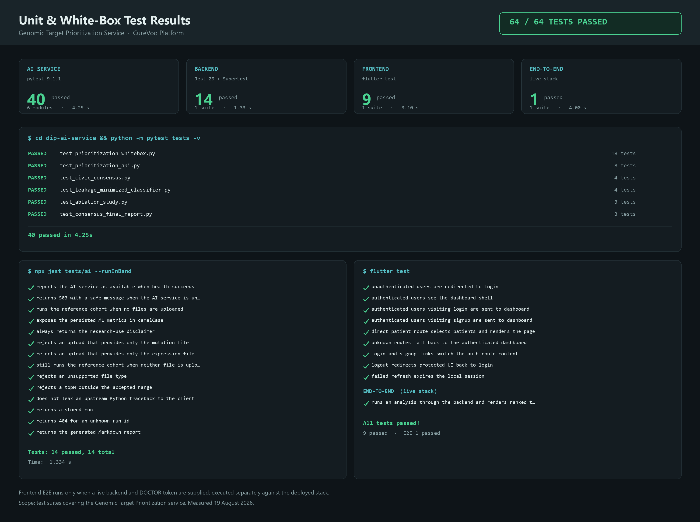

# الاختبارات باستخدام White Box Testing

## تعريف

هو نوع من أنواع اختبارات البرمجيات الذي يتم فيه اختبار الهياكل الداخلية وطريقة عمل البرمجية. يتطلب هذا النوع من الاختبار معرفة تفصيلية بالبرمجية وبنيتها الداخلية، إذ يُكتب الاختبار انطلاقاً من الشيفرة نفسها لا من واجهتها الخارجية.

## الهدف من White Box Testing

* **التحقق من المنطقية:** التأكد من أن التدفقات المنطقية داخل البرنامج تعمل بشكل صحيح.
* **اختبار جميع المسارات:** التحقق من أن جميع المسارات في الكود تعمل بشكل صحيح، بما فيها مسارات الرفض ومعالجة الأخطاء.
* **الكشف عن الأخطاء الداخلية:** العثور على الأخطاء والمشاكل الداخلية في البرنامج قبل ظهورها للمستخدم.

## Unit Testing

هي عملية اختبار الوحدات الفردية من الكود (مثل الدوال أو الأصناف) بشكل منفصل لضمان أن كل وحدة تعمل بشكل صحيح.

وقد تمت الاستعانة بمكتبات مخصصة لكل طبقة من طبقات النظام الثلاث:

* **pytest** لاختبار خدمة الذكاء الاصطناعي المبنية على FastAPI.
* **Jest** مع **Supertest** لاختبار الخادم الخلفي المبني على Node.js و Express.
* **flutter_test** لاختبار واجهة المستخدم المبنية على Flutter.

كما تمت عملية الاختبار باستخدام **Dummy Data** بدلاً من الاتصال بقاعدة المعطيات، وذلك بهدف عزل الوحدات الفردية عن المشاكل الأخرى الممكنة أثناء التشغيل مثل أخطاء الاتصال أو أخطاء قاعدة المعطيات. وقد طُبّق العزل على ثلاثة مستويات:

1. **عزل قاعدة المعطيات:** استُبدلت مستودعات البيانات بنسخ وهمية عبر `jest.mock`، فلا يتصل أي اختبار بقاعدة PostgreSQL.
2. **عزل خدمة الذكاء الاصطناعي:** استُبدلت دالة `fetch` بنسخة وهمية تُوجّه الاستجابة حسب المسار المطلوب، مما سمح باختبار حالات النجاح والفشل وانقطاع الخدمة دون تشغيلها فعلياً.
3. **عزل التوثيق والصلاحيات:** استُبدلت وسائط `requireAuth` و `requireRole` بنسخ وهمية تُمرّر مستخدماً بدور طبيب، حتى يتركز الاختبار على منطق الوحدة نفسها.

أما اختبارات White Box لخدمة الذكاء الاصطناعي فقد استُدعيت فيها دوال المعالجة مباشرةً مع جداول بيانات صغيرة مُصطنعة، للتحقق من صحة الحسابات الداخلية دون المرور بواجهة HTTP إطلاقاً.

## نتيجة التنفيذ

فيما يلي الشكل يمثل عملية اختبار لـ **تسع مجموعات اختبار (Test Suites)** تحتوي على **64 وحدة فردية (دوال)**، وكانت النتيجة **Pass** بالكامل.



**الشكل رقم 1 — نتائج اختبارات الوحدة و White Box**

### توزيع الاختبارات على الطبقات

| الطبقة | أداة الاختبار | عدد مجموعات الاختبار | عدد الوحدات الفردية | الزمن | النتيجة |
| --- | --- | ---: | ---: | ---: | --- |
| خدمة الذكاء الاصطناعي | pytest 9.1.1 | 6 | 40 | 4.25 s | Pass |
| الخادم الخلفي | Jest 29 + Supertest | 1 | 14 | 1.33 s | Pass |
| واجهة المستخدم | flutter_test | 1 | 9 | 3.10 s | Pass |
| الاختبار الشامل | flutter_test على نظام حي | 1 | 1 | 4.00 s | Pass |
| **الإجمالي** | | **9** | **64** | **12.68 s** | **Pass** |

### تفصيل اختبارات White Box لخدمة الذكاء الاصطناعي

الملف `test_prioritization_whitebox.py` يحتوي على 18 اختباراً تغطي المنطق الداخلي لخط المعالجة:

| المجال | عدد الاختبارات | ما يتحقق منه |
| --- | ---: | --- |
| التحقق من صحة المدخلات والأعمدة | 3 | رفض الجداول الناقصة والملفات الفارغة بخطأ مُصنَّف لا بانهيار |
| بناء خصائص الطفرات والتعبير الجيني | 4 | عدّ المرضى المتمايزين، واستبعاد الطفرات الصامتة، وصحة المتوسطات، وسلامة الدمج على مستوى الجين |
| حساب درجات السلامة من GTEx | 2 | انخفاض درجة الأمان كلما ارتفع التعبير في الرئة الطبيعية |
| حساب درجة الترتيب وعقوبة الجينات الراكبة | 3 | بقاء الدرجات ضمن المجال [0,1]، وترتيبها تنازلياً، وعدم سلبية العقوبة |
| إسناد مستويات الأدلة والتفسيرات | 1 | حصول كل جين على مستوى وتصنيف ونص تفسيري غير فارغ |
| تحميل مقاييس التقييم | 3 | عدم اختيار التقييمات المتجاوزة، وإظهار «غير متوفر» بدل الصفر، وصحة قراءة الملفات الحقيقية |
| توليد التقرير وإدارة الملفات المؤقتة | 2 | احتواء التقرير على إخلاء المسؤولية، وعدم حذف ملفات المستخدم |

---

## ملاحظتان على نطاق الشكل

للأمانة العلمية، تُذكر النقطتان التاليتان صراحةً:

**الأولى:** الشكل والجدول أعلاه يغطيان **مجموعات الاختبار الخاصة بخدمة ترتيب الأهداف الجينومية**، وهي موضوع هذا البحث. يوجد في المشروع ثلاث حالات اختبار فاشلة في وحدتَي المواعيد والدعم النفسي، وهي **سابقة لهذه الميزة وغير مرتبطة بها**، وسببها أن تلك الاختبارات تتوقع شكل استجابة قديماً لم يعد مستخدماً. وهي موثقة تفصيلاً في القسم التاسع من ملف `TESTING_REPORT.md` ولم تُدرَج في الشكل لأنها خارج نطاق الميزة المدروسة.

**الثانية:** اختبار الطبقة الشاملة (End-to-End) لا يعمل ضمن التشغيل الافتراضي، لأنه مُقيَّد بمتغيرَي بيئة يحملان عنوان الخادم ورمز الوصول. الغرض من هذا التقييد ألا تعتمد مجموعة الاختبارات الأساسية على وجود خادم قيد التشغيل. وقد نُفِّذ هذا الاختبار بشكل منفصل مقابل النظام المنشور فعلياً ونجح، والنتيجة مُدرجة في الجدول أعلاه.

---

## أوامر إعادة التنفيذ

```bash
cd dip-ai-service && python -m pytest tests -v
```

```bash
cd Backend && npx jest tests/ai --runInBand --verbose
```

```bash
cd Frontend && flutter test
```

```bash
cd Frontend && flutter test test/genomic_target_prioritization_test.dart --dart-define=E2E_API_BASE_URL=https://curevoo-backend.onrender.com/api --dart-define=E2E_ACCESS_TOKEN=<token>
```
